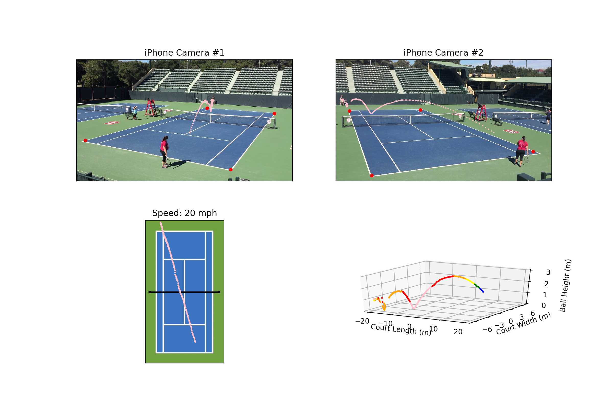

## How to run
### Get the 3d trajectory 
`cd code
python ballIntersectMain.py
`
###  Visualize the 3d trajectory
`
python VisualizeResults.py ../Stereo_Clips/stereoClip3_Megan.mov ../Stereo_Clips/stereoClip3_Kyle.mov ../jst_output/ballEst.csv
`

## Tennis Ball Tracking: 3D Trajectory Estimation using Smartphone Videos
