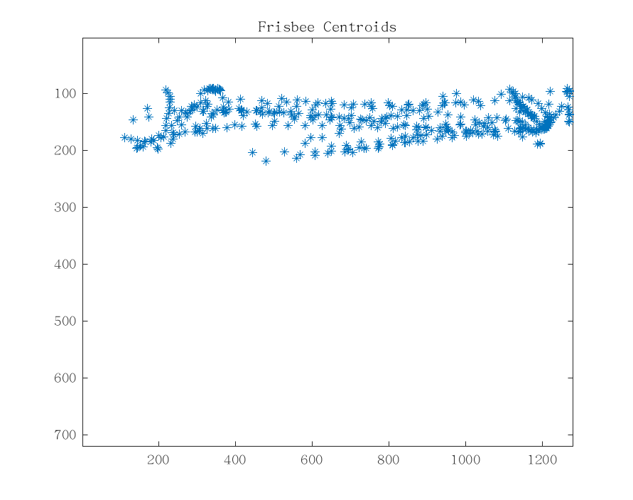

# Computer Vision-Driven Ultimate Frisbee Tracking and Analytics

This project presents work on the detection, tracking,and  localization  of  the  frisbee  and  players  in  test/game  footage of the sport Ultimate Frisbee. In the frisbee detection procedure,the features are extracted from video frames using color, shape,and size cues obtained from digital image processing techniques.However, the problem of finding the frisbee position in real game footage is challenging because the appearance of the frisbee variesirregularly  over  frames.  This  includes  the  frisbee’s  size,  shape,and  brightness.  Many  other  moving  objects  may  also  appear similar  to  the  frisbee,  such  as  specific  bright  regions  on  players(hats,  jersey  numbers,  cleats,  etc.).  This  project  aims  to  find the  best  method  to  localize  both  the  players  and  the  frisbee,with  the  ultimate  goal  of  automatic  pass  counting.

The project works with 3 algorithms: Morphological Testing, Template Matching and Background Subtraction to extract the position of the frisbee and the players. The algorithms were first vetted with Test footage that has either 2 or 3 players. Later the alorithms were tested with real game footage.

| Name of the file           | Description                                              | 
| ---------------------------|----------------------------------------------------------| 
| initial_testing.m          | Code for initial testing on online video footage.        | 
| Background_subtraction.m   | Code for Background subtraction on test footage.         |   
| Template_matching.m        | Code for Template Matching on test footage               |  
| tmc.m                      | Code for function used in Template matching              |  

On test footage it was noted that the Morphological Testing worked best and hence was used to go further and extract frisbee centroids and player regions.

| Name of the file           | Description                                                                 | 
| ---------------------------|-----------------------------------------------------------------------------| 
| test_2person.m             | Code for testing the frisbee and player tracking on 2 player footage        | 
| test_3person.m	     | Code for testing the frisbee and player tracking on 3 player footage        |   
| count_passes_2person.m     | Code for function to Count passes in 2 player footage                       |  
| count_passes_3person.m     | Code for function to Count passes in 3 player footage                       |                  
| locate_players.m	     | Code for function to locate players                                         |                   

The project later used real game footage to test the algorithms

| Name of the file           | Description                                                                 | 
| ---------------------------|-----------------------------------------------------------------------------| 
| test_gamefootage.m         | Code for testing the frisbee and player tracking on real game footage       | 
| count_passes.m	     | Code for Count passes in real game footage 				   | 

The second phase of the project is to evaluate the performance of these algorithms against the OpenCV tracking algorithms namely CSRT,KLF, MOSSE.

| Name of the file           | Description                                                                 | 
| ---------------------------|-----------------------------------------------------------------------------| 
| opencv_object_tracking.py  | Python Code for implementing OpenCV object trackers			   | 

python opencv_object_tracking.py -v test_3person.mp4 -t mosse

